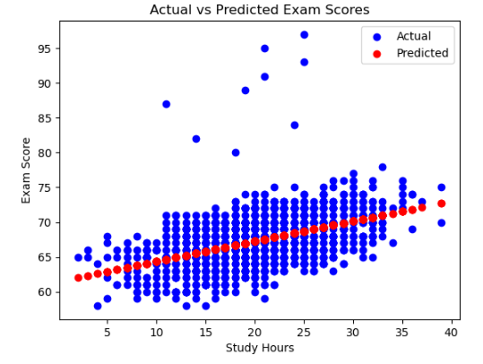
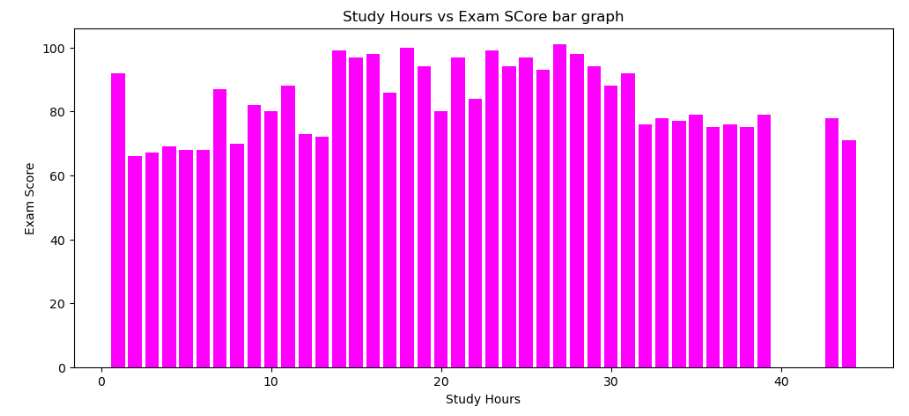
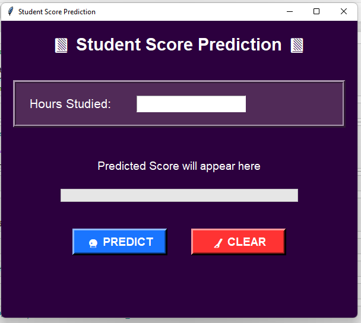
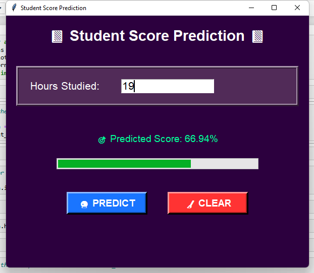
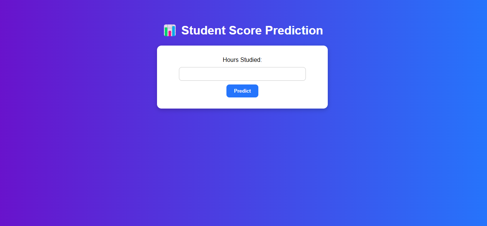

🎓 Student Score Prediction Model  

A Machine Learning project that predicts student scores based on study habits, attendance, sleep hours, tutoring sessions, and previous academic performance.  

This repository includes:  
- 📦 A trained **Linear Regression model**  
- 🖥️ An interactive **Tkinter GUI** for offline use  
- 🌐 A **live demo** (first model: Hours Studied → Score)  

---

🚀 Features
- ✅ Predicts student scores based on multiple inputs (hours studied, sleep, attendance, etc.)  
- ✅ Interactive **Tkinter GUI** for local testing  
- ✅ Built with **Linear Regression**  
- ✅ Easy to run locally (just clone & run)  
- ✅ Future-ready for deployment (Flask, Django, or Streamlit)  

---

📊 Dataset
Two versions of the model were trained:  

1. **Single Feature Model**  
   - Input: Hours Studied  
   - Output: Student Final Score (%)  

2. **Multi-Feature Model**  
   - Inputs:  
     - Hours Studied  
     - Attendance (%)  
     - Sleep Hours  
     - Previous Scores  
     - Tutoring Sessions  
     - Physical Activity  
   - Output: Student Final Score (%)  

---
 

🌐 Live Demo

🔗 https://elevvopathway-ml-internship-model1.onrender.com/

🤝 Contributing

Contributions, issues, and feature requests are welcome!
Feel free to fork the repo and submit a pull request.

📜 License

This project is licensed under the MIT License.

# Install dependencies
pip install -r requirements.txt

# Run the Tkinter app
python app.py

## 📷 Screenshots

### Scatter Plot (Actual score vs Predicted score)

### Exam Score Bar Graph

### Tkinter GUI

### Tkinter Result

### Django Application

